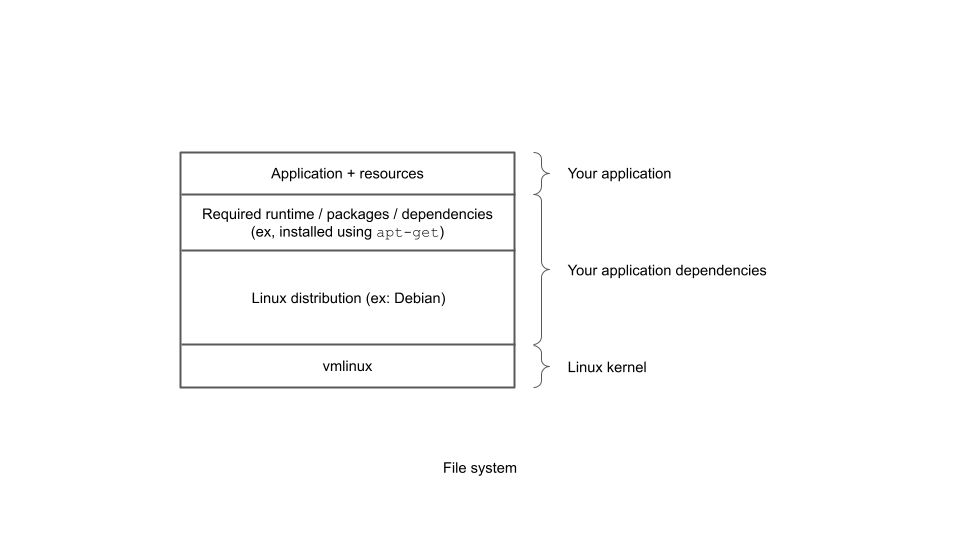
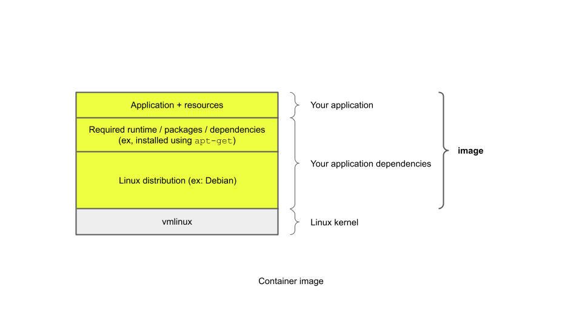
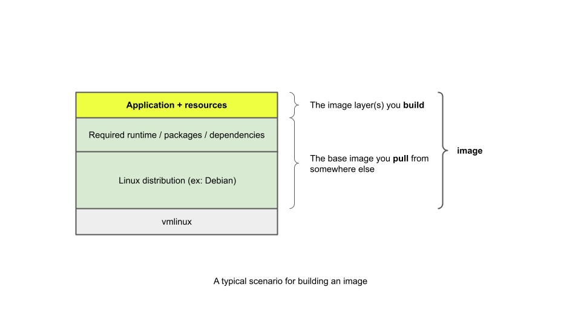

The examples in this section of the guide will

- Introduce you to the basics of writing a Dockerfile to containerize an app.
- Introduce you to common
[Docker CLI commands](https://docs.docker.com/engine/reference/commandline/cli/)
for manipulating images and containers.

**What does *containerizing an app* actually mean?**

When we talk about containerizing an app, what we mean by that is that the app
will be configured to execute in a virtualized environment, called a container,
that isolates it from the rest of the host machine (and, conversely, insulates
the host machine from it):

- From the perspective of the host computer, processes in a container
  effectively execute in a sandbox that restricts access and imposes resource
  (cpu, memory, network, file system, etc.) consumption limits on that set of
  processes.
- From the perspective of any processes running inside a container, it appears
  as if they have exclusive use of the set of computer's resources in the
  environment they've been provided with.

In essence, a container is a logical abstraction based on Linux isolation
features available in the kernel for governing access and consumption limits
over system resources for a group of one or more processes when they are
executed.

In general, there is one primary process that runs in a container
(such as a web server or database), although multiple, generally related,
processes (such as an agent or worker process) can run within the same
container.

<!-- markdownlint-disable --> 
{}
&#x1F913; **Nerd note**

If containers sound a bit like virtual machines to you, that's
completely understandable.

To clarify the container concept further, however, if you're somewhat familiar
with Linux and virtual machines, then understand that when it comes to
containers, it's the Linux kernel that provides the system abstraction, whereas
for virtual machines it's the hypervisor that provides it.

Processes in containers can start so quickly because they're just Linux
processes using the standard system call interface to the shared host kernel;
the kernel is responsible for virtualizing access to system resources.

Virtual machines do not share the host kernel space and need to boot up their
own copies of an entire operating system before they can run a target
application. This often takes several minutes. Access to physical resources is
virtualized by the hypervisor, not the kernel.

For modern cloud computing, container technology helps to make applications
scale quickly according to needs, but it's also interesting to note that most
clouds run containers on virtual machines that are provisioned for your use, as
this is generally more cost effective and pragmatic then provisioning dedicated
physical machines.
{}
<!-- markdownlint-restore -->

**What does this entail?**

To run a container, you first need an image.

This is somewhat analogous to the concept that to run a program, you first need
to have an executable binary. You either need to install it from some source or
you need to build it yourself. In a similar vein, you need to get the image from
somewhere or you need build it.

Docker does a number of things to make working with container technology
easier for developers.

Similar to package managers, like `apt` and `yum`, Docker launch a container
ecosystem by creating a public registry ([Docker Hub](https://hub.docker.com/))
where you can find repositories for various images. Nowadays, you can use many
other registries as well, such as
[Container Registry](https://cloud.google.com/container-registry),
[Artifact Registry](https://cloud.google.com/artifact-registry/docs/docker/quickstart),
and
[GitHub Container Registry](https://docs.github.com/en/packages/working-with-a-github-packages-registry/working-with-the-container-registry).

The other way is that Docker defines an instruction set that you can use use in
a text file, called a **Dockerfile**, for building your own image.

An **image** is used to package up all the bits necessary for the runtime
environment for a container -- minus the Linux kernel, which is provided by the
host computer. This is a big difference from virtual machines, which must also
package up a host operating system that needs to boot up before running anything
else.

Below is a simplified view of a file system with all the bits for the Linux
kernel, distribution, runtime dependencies (such as Node.js, Python, etc.), and
application plus any static resources.

When you build an image, this is what it comprises:

As you'll find out soon, you often can find (or build separately) a base image
that you can use as a foundation for your application image, as shown below:

A Docker image need only contain as much of a Linux distribution above and
beyond the kernel to provide the runtime support necessary for executing your
application. Some Docker images include a full Linux distribution, some include
just a very small subset of one, and some don't need anything at all to run the
intended executable if there are no dependencies on any shared system runtime
files.

By the you're finished with this guide, you'll be familiar with strategies
for choosing appropriate base images as well as for creating your own images
to suit your requirements.

## What's next

While it's possible to create Docker images interactively, as a developer you'll
want to understand how to create them programmatically using a Dockerfile. A
Dockerfile is a text file that uses specific instructions for building a Docker
image.

Coming up next you'll write a short **Dockerfile**. You'll use the Dockerfile to
build a
**Docker image** that incorporates your program.

Then you'll use the image to launch a **container**. Your program executes
"inside" this container.

<!-- markdownlint-disable --> 
{}
&#x1F9D0; **If you want to know more...**

See this informative
[blog post](https://blog.aquasec.com/a-brief-history-of-containers-from-1970s-chroot-to-docker-2016)
if you're interested in learning more about the history of container technology.
{}
<!-- markdownlint-restore -->
